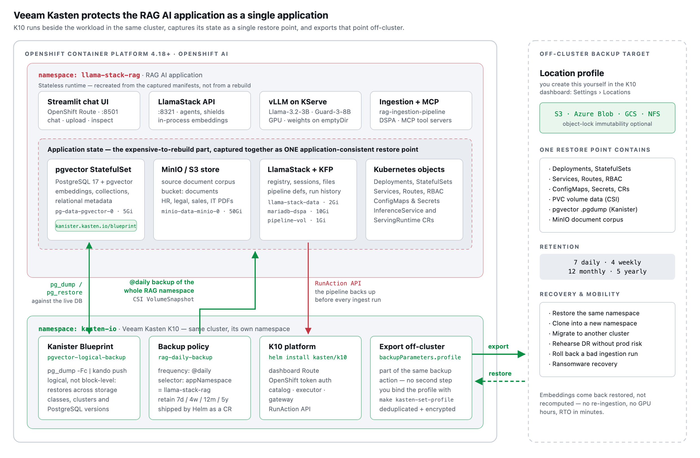

<!-- omit from toc -->
# Centralize company knowledge with an Enterprise RAG Chatbot

[](https://github.com/rh-ai-quickstart/RAG/releases)
[](https://quay.io/repository/rh-ai-quickstart/llamastack-dist-ui)

Use retrieval-augmented generation (RAG) to enhance large language models with specialized data sources for more accurate and context-aware responses.

<!-- omit from toc -->
## Table of Contents
- [Detailed description](#detailed-description)
  - [Data protection and resilience with Veeam Kasten](#data-protection-and-resilience-with-veeam-kasten)
  - [Architecture diagrams](#architecture-diagrams)
- [Requirements](#requirements)
  - [Minimum hardware requirements](#minimum-hardware-requirements)
  - [Minimum software requirements](#minimum-software-requirements)
  - [Required user permissions](#required-user-permissions)
- [Deploy](#deploy)
  - [Prerequisites](#prerequisites)
  - [Supported Models](#supported-models)
  - [Installation Steps](#installation-steps)
  - [Protect the Deployment with Veeam Kasten](#protect-the-deployment-with-veeam-kasten)
  - [Local Deployment](#local-deployment)
- [Tags](#tags)


## Detailed description

See how FantaCo, a fictional large enterprise, launched a secure RAG chatbot that connects employees to internal HR, procurement, sales, and IT documentation. From policies to startup guides, employees get fast, accurate answers through a single chat interface. Advanced users can extend the experience with AI agents for deeper workflows. 

Retrieval-Augmented Generation (RAG) enhances Large Language Models (LLMs) by retrieving relevant external knowledge to improve accuracy, reduce hallucinations, and support domain-specific conversations.

This QuickStart allows users to explore the capabilities of RAG by:

- Exploring FantaCo's solution
- Uploading new documents to be embedded
- Tweaking sampling parameters to influence LLM responses
- Using custom system prompts
- Switching between simple and agent based RAG


### Data protection and resilience with Veeam Kasten

A production RAG chatbot is not a stateless application. The intelligence that makes FantaCo's assistant useful lives in state that is scattered across the namespace: vector embeddings and their relational metadata in PostgreSQL + PGVector, ingested source documents in S3/MinIO object storage, LlamaStack configuration and session data, Kubeflow pipeline definitions and run history, model-serving configuration, and the ConfigMaps, Secrets, and Routes that wire it all together. Lose any one of those pieces and the chatbot does not simply stop — it keeps answering, but with stale, incomplete, or wrong context. Rebuilding it from scratch means re-running ingestion and re-embedding the entire corpus, consuming hours of GPU/CPU time while the business waits.

**[Veeam Kasten](https://www.veeam.com/products/cloud/kubernetes-data-protection.html) is a Kubernetes-native data management platform** built specifically for containerized applications. Rather than treating a cluster as a set of volumes to be snapshotted, Kasten understands the *application*: it discovers the workloads, custom resources, configuration, and persistent data that constitute a running app, then captures, moves, and restores them as a coherent unit. This QuickStart ships a complete Kasten configuration so you can experience that model against a real AI workload — see [Protect the Deployment with Veeam Kasten](#protect-the-deployment-with-veeam-kasten).



*Kasten K10 runs in its own `kasten-io` namespace, alongside — not inside — the RAG application: the `rag-daily-backup` policy selects the RAG namespace, snapshots every PVC through CSI, runs the Kanister blueprint against pgvector, and exports the resulting restore point to the location profile you define. Editable source: [`kasten-rag-protection.svg`](docs/images/kasten-rag-protection.svg).*

#### One application, one restore point

Kasten captures the entire OpenShift AI RAG application — the vector database, the relational metadata that indexes it, the object-store document corpus, and every Kubernetes object that defines the deployment — into a **single, application-consistent restore point**.

| RAG component | State protected by Kasten |
|---------------|---------------------------|
| PostgreSQL + PGVector | Vector embeddings, collections, and relational schema and metadata |
| S3 / MinIO document store | Source documents that feed the ingestion pipeline |
| LlamaStack | Configuration, registered models and shields, session state |
| Kubeflow / Data Science Pipelines | Pipeline definitions, run history, and artifacts |
| Model serving (vLLM / KServe) | InferenceService and serving-runtime definitions |
| Application plumbing | Deployments, StatefulSets, Services, Routes, ConfigMaps, Secrets, RBAC, CRs |

The distinction matters. Backing up the vector database on its own leaves you with embeddings that no longer match the documents they were derived from, or a database that no application knows how to reach. A Kasten restore point is internally consistent across *all* of it, so a recovery returns a working chatbot rather than a pile of correlated-but-unaligned data that an engineer has to reassemble by hand.

#### Orchestration, not just snapshots

Stateful services need more than a volume copy. Kasten's orchestration engine — built on the open-source [Kanister](https://kanister.io/) framework — lets each workload define exactly *how* it should be quiesced, captured, and brought back:

- **Application-aware capture.** The [`pgvector-logical-backup` blueprint](deploy/helm/kasten/templates/pgvector-blueprint.yaml) included here runs a `pg_dump` against the live pgvector instance and streams it directly to your backup target. Because the result is a logical dump rather than a block-level snapshot, it restores cleanly across different storage classes, clusters, and even PostgreSQL versions — the foundation for migration and dev/test cloning, not only recovery.
- **Automatic discovery.** Kasten finds the workloads that need special handling through a single annotation (`kanister.kasten.io/blueprint`), applied to the pgvector StatefulSet automatically at install time. Adding protection for another stateful service is a blueprint and an annotation — not a new backup pipeline.
- **Sequenced, dependency-aware recovery.** On restore, Kasten replays the operation in the correct order: recreate namespace resources, restore persistent volumes, then run the blueprint's logical restore phase, so pods come back attached to the right data with no manual sequencing by an operator at 2 a.m.
- **Policy-driven and declarative.** The [backup policy](deploy/helm/kasten/templates/rag-policy.yaml) shipped here protects everything in the RAG namespace on a schedule with tiered retention (7 daily / 4 weekly / 12 monthly / 5 yearly), exported off-cluster to a location profile. It is a Kubernetes custom resource delivered by Helm, so protection is versioned and deployed alongside the application itself and fits naturally into a GitOps workflow.
- **Programmable, event-driven backups.** Kasten's API can be invoked from anywhere in your automation. This QuickStart wires it into the [data ingestion pipeline](notebooks/data-ingestion-pipeline.ipynb): a `trigger_kasten_backup` step calls the K10 `RunAction` API and blocks until the backup completes *before* any new documents mutate the vector database. Every ingestion run is therefore preceded by a known-good rollback point — so a bad document batch, a corrupted embedding run, or a poisoned source corpus is an undo operation rather than an incident.

#### Lower RTO, lower operational overhead

Without a single restore point, recovering this application is a multi-team, multi-hour project: re-provision the namespace, restore or rebuild PostgreSQL, re-seed object storage, re-run ingestion and re-embed the corpus, reconcile secrets and routes, then validate that retrieval quality actually came back. Every step is manual, ordered, and easy to get wrong under pressure.

With Kasten it is one restore action against one restore point:

- **RTO measured in minutes, not hours or days.** Recovery becomes a single orchestrated operation instead of a sequence of hand-run procedures — and because the embeddings are restored rather than regenerated, you skip the re-ingestion and re-embedding compute entirely.
- **No bespoke backup tooling to maintain.** One policy replaces per-component scripts, cron jobs, and tribal knowledge. Protection is declared once, in the same Helm workflow that deploys the application.
- **Predictable, testable recovery.** Restores can be rehearsed into a separate namespace or cluster on demand, turning DR from an assumption into something you have actually verified.
- **Reuse beyond recovery.** The same restore point powers cluster migration, environment cloning for evaluation and testing, and ransomware resilience through immutable, off-cluster backup copies.

For an AI platform team, the practical result is that the RAG application's most valuable and most expensive-to-rebuild asset — its knowledge — is protected with the same rigor, and the same automation, as the code that serves it.


### Architecture diagrams


*This diagram illustrates both the ingestion pipeline for document processing and the RAG pipeline for query handling. For more details click [here](docs/rag-reference-architecture.md).*

For how this deployment is backed up, restored, and moved between clusters, see the data protection architecture in [Data protection and resilience with Veeam Kasten](#data-protection-and-resilience-with-veeam-kasten).

| Layer/Component | Technology | Purpose/Description |
|-----------------|------------|---------------------|
| **Orchestration** | OpenShift AI | Container orchestration and GPU acceleration |
| **Framework** | LLaMA Stack | Standardizes core building blocks and simplifies AI application development |
| **UI Layer** | Streamlit | User-friendly chatbot interface for chat-based interaction |
| **LLM** | Llama-3.2-3B-Instruct | Generates contextual responses based on retrieved documents |
| **Safety** | Safety Guardrail | Blocks harmful requests and responses for secure AI interactions |
| **Integration** | MCP Servers | Model Context Protocol servers for enhanced functionality |
| **Embedding** | all-MiniLM-L6-v2 | Converts text to vector embeddings |
| **Vector DB** | PostgreSQL + PGVector | Stores embeddings and enables semantic search |
| **Retrieval** | Vector Search | Retrieves relevant documents based on query similarity |
| **Data Ingestion** | Kubeflow Pipelines | Multi-modal data ingestion with preprocessing pipelines for cleaning, chunking, and embedding generation |
| **Storage** | S3 Bucket | Document source for enterprise content |
| **Data Protection** | Veeam Kasten | Application-consistent backup, restore, and mobility for the entire RAG namespace, including the pgvector database |


## Requirements 

### Minimum hardware requirements 
- 1 GPU/HPU with 24GB of VRAM for the LLM, refer to the [chart below](#supported-models)
- 1 GPU/HPU with 24GB of VRAM for the safety/shield model (optional)
- Xeon deployments: one worker node with Intel Xeon processors, Sapphire Rapids (SPR) or newer (EMR/GNR)
  - for example: m8i.8xlarge, m7i.8xlarge, r8i.8xlarge
  - vLLM requires a minimum of 16 vCPUs and 64 GB of RAM to run

### Minimum software requirements 
- OpenShift Client CLI - [oc](https://docs.redhat.com/en/documentation/openshift_container_platform/4.18/html/cli_tools/openshift-cli-oc#installing-openshift-cli)
- OpenShift Cluster 4.18+
- OpenShift AI
- Helm CLI - helm
- Veeam Kasten (optional, for data protection) - a CSI driver with `VolumeSnapshot` support and an off-cluster object store for backup exports

### Required user permissions 
- Regular user permission for default deployment
- Cluster admin required for *advanced* configurations


## Deploy

*The instructions below will deploy this quickstart to your OpenShift environment.*

*Please see the [local deployments](#local-deployment) section for additional deployment options.* 

### Prerequisites
- [huggingface-cli](https://huggingface.co/docs/huggingface_hub/guides/cli) (optional)
- [Hugging Face Token](https://huggingface.co/settings/tokens)
- Access to [Meta Llama](https://huggingface.co/meta-llama/Llama-3.2-3B-Instruct/) model
- Access to [Meta Llama Guard](https://huggingface.co/meta-llama/Llama-Guard-3-8B/) model
- Some of the example scripts use `jq` a JSON parsing utility which you can acquire via `brew install jq`

### Supported Models

| Function    | Model Name                             | Hardware    | AWS
|-------------|----------------------------------------|-------------|-------------
| Embedding   | `all-MiniLM-L6-v2`                     | CPU/GPU/HPU |
| Generation  | `meta-llama/Llama-3.2-3B-Instruct`     | L4<br>HPU<br>Xeon | g6.2xlarge<br>N/A<br>m8i.8xlarge
| Generation  | `meta-llama/Llama-3.1-8B-Instruct`     | L4<br>HPU<br>Xeon | g6.2xlarge<br>N/A<br>m8i.8xlarge
| Generation  | `meta-llama/Meta-Llama-3-70B-Instruct` | A100 x2/HPU | p4d.24xlarge
| Safety      | `meta-llama/Llama-Guard-3-8B`          | L4/HPU      | g6.2xlarge

- Note: Developers can also use a remote LLM via the command line (see [Remote LLM Deployment](#remote-llm-deployment-example)) or by modifying the `rag-values.yaml` file directly:

```yaml
  global:
    models:
      remote-llm:
        id: meta-llama/Llama-3.3-70B-Instruct
        url: https://somedomain.com/v1
        apiToken: fake-token
        enabled: true
```

Note: the 70B model is NOT required for initial testing of this example. The safety/shield model `Llama-Guard-3-8B` is also optional.

### Installation Steps

1. **Clone Repository**

```bash
git clone https://github.com/rh-ai-quickstart/RAG
```

2. **Login to OpenShift**

```bash
oc login --server="<cluster-api-endpoint>" --token="sha256~XYZ"
```

3. **Hardware Configuration**

Determine what hardware acceleration is available in your cluster and configure accordingly.

**For NVIDIA GPU nodes**: If GPU nodes are tainted, find the taint key. In the example below the key for the taint is `nvidia.com/gpu`

```bash
oc get nodes -l nvidia.com/gpu.present=true -o yaml | grep -A 3 taint 
```

**For Intel Gaudi HPU nodes**: If HPU nodes are tainted, find the taint key. The taint key is typically `habana.ai/gaudi`

```bash
oc get nodes -l habana.ai/gaudi.present=true -o yaml | grep -A 3 taint 
```

The output of either command may be something like below:
```
taints:
  - effect: NoSchedule
    key: nvidia.com/gpu  # or habana.ai/gaudi for HPU
    value: "true"
```

You can work with your OpenShift cluster admin team to determine what labels and taints identify GPU-enabled or HPU-enabled worker nodes. It is also possible that all your worker nodes have accelerators therefore have no distinguishing taint.

4. **Navigate to Deployment Directory**

```bash
cd deploy/helm
```

5. **List Available Models**

```bash
make list-models
```

The above command will list the models to use in the next command:

```bash
(Output)
model: llama-3-1-8b-instruct (meta-llama/Llama-3.1-8B-Instruct)
model: llama-3-2-1b-instruct (meta-llama/Llama-3.2-1B-Instruct)
model: llama-3-2-1b-instruct-quantized (RedHatAI/Llama-3.2-1B-Instruct-quantized.w8a8)
model: llama-3-2-3b-instruct (meta-llama/Llama-3.2-3B-Instruct)
model: llama-3-3-70b-instruct (meta-llama/Llama-3.3-70B-Instruct)
model: llama-guard-3-1b (meta-llama/Llama-Guard-3-1B)
model: llama-guard-3-8b (meta-llama/Llama-Guard-3-8B)
```

The "guard" models can be used to test shields for profanity, hate speech, violence, etc.

6. **Deploy with Helm**

Use the taint key from above as the `LLM_TOLERATION` and `SAFETY_TOLERATION`. The namespace will be auto-created.

> **Note Running just `make install` from the deploy/helm directory will create a rag_values.yml file which can be edited to use in deployments.**

**GPU Deployment Examples (Default):**

To install only the RAG example, no shields:

```bash
make install NAMESPACE=llama-stack-rag LLM=llama-3-2-3b-instruct LLM_TOLERATION="nvidia.com/gpu"
```

To install both the RAG example as well as the guard model to allow for shields:

```bash
make install NAMESPACE=llama-stack-rag LLM=llama-3-2-3b-instruct LLM_TOLERATION="nvidia.com/gpu" SAFETY=llama-guard-3-8b SAFETY_TOLERATION="nvidia.com/gpu"
```

*Note: `DEVICE=gpu` is the default and can be omitted.*

**Intel Gaudi HPU Deployment Examples:**

To install only the RAG example on Intel Gaudi HPU nodes:

```bash
make install NAMESPACE=llama-stack-rag LLM=llama-3-2-3b-instruct LLM_TOLERATION="habana.ai/gaudi" DEVICE=hpu
```

To install both the RAG example and guard model on Intel Gaudi HPU nodes:

```bash
make install NAMESPACE=llama-stack-rag LLM=llama-3-2-3b-instruct LLM_TOLERATION="habana.ai/gaudi" SAFETY=llama-guard-3-8b SAFETY_TOLERATION="habana.ai/gaudi" DEVICE=hpu
```

**CPU Deployment Example:**

To install on CPU nodes only:

```bash
make install NAMESPACE=llama-stack-rag LLM=llama-3-2-3b-instruct DEVICE=cpu
```

**Xeon Deployment Example:**
To install on Xeon nodes only:

```bash
make install NAMESPACE=llama-stack-rag LLM=llama-3-2-3b-instruct DEVICE=xeon
```
- This assumes that all your worker nodes use Sapphire Rapids (SPR) or newer Intel Xeon processors.
- If you have heterogeneous worker nodes, work with your cluster administrator to identify SPR+ nodes and use taint keys, similar to the GPU and HPU deployments above, to set `LLM_TOLERATION` and `SAFETY_TOLERATION` to schedule on valid nodes.

**Simplified Commands (No Tolerations Needed):**

If you have no tainted nodes (all worker nodes have accelerators), you can use simplified commands:

```bash
# GPU deployment (default - DEVICE=gpu can be omitted)
make install NAMESPACE=llama-stack-rag LLM=llama-3-2-3b-instruct SAFETY=llama-guard-3-8b

# HPU deployment  
make install NAMESPACE=llama-stack-rag LLM=llama-3-2-3b-instruct SAFETY=llama-guard-3-8b DEVICE=hpu

# CPU deployment
make install NAMESPACE=llama-stack-rag LLM=llama-3-2-3b-instruct SAFETY=llama-guard-3-8b DEVICE=cpu

# Xeon deployment
make install NAMESPACE=llama-stack-rag LLM=llama-3-2-3b-instruct SAFETY=llama-guard-3-8b DEVICE=xeon

```

**Remote LLM Deployment Example:**

To connect to a remote LLM endpoint instead of deploying a local model, use `LLM_URL` and `LLM_API_TOKEN`:

```bash
make install NAMESPACE=llama-stack-rag \
  LLM=remote-llm \
  LLM_URL=https://my-model-endpoint.example.com/v1 \
  LLM_API_TOKEN=my-api-token
```

| Parameter | Description |
|-----------|-------------|
| `LLM=remote-llm` | Indicates a remote model (no local vLLM deployment) |
| `LLM_URL` | The base URL of the remote model endpoint |
| `LLM_API_TOKEN` | Authentication token for the remote endpoint |

This skips local model deployment and configures LlamaStack to use the remote inference endpoint directly. No GPU or HF token is required for the LLM.

When prompted, enter your **[Hugging Face Token](https://huggingface.co/settings/tokens)**.

Note: This process may take 10 to 30 minutes depending on the number and size of models to be downloaded.

7. **Monitor Deployment**

```bash
oc get pods -n llama-stack-rag
```

Watch for all pods to reach Running or Completed status. Key pods to watch include **predictor** in their name (these are the KServe model servers running vLLM):

```bash
oc get pods -l component=predictor
```

Look for **2/2** (or **3/3** when RAW_DEPLOYMENT=false) under the Ready column.

8. **Verify Installation**

Watch the **llamastack** pod as that one becomes available after all the model servers are up:

```bash
oc get pods -l app.kubernetes.io/name=llamastack
```

Verify all resources:

```bash
oc get pods -n llama-stack-rag
oc get svc -n llama-stack-rag
oc get routes -n llama-stack-rag
```

For detailed post-installation verification, configuration options, and usage instructions, see the [complete OpenShift deployment guide](docs/openshift_setup_guide.md).

### Protect the Deployment with Veeam Kasten

Once the RAG application is running, deploy Veeam Kasten to protect it. See [Data protection and resilience with Veeam Kasten](#data-protection-and-resilience-with-veeam-kasten) for why this matters and for an architecture diagram of how the pieces fit together. The chart in [`deploy/helm/kasten`](deploy/helm/kasten) installs Kasten K10, the pgvector Kanister blueprint, and a daily backup policy covering the whole RAG namespace.

1. **Install Kasten K10 and the RAG data protection configuration**

From the `deploy/helm` directory:

```bash
make install-kasten NAMESPACE=llama-stack-rag
```

This installs Kasten K10 into the `kasten-io` namespace with OpenShift token authentication, deploys the `pgvector-logical-backup` Kanister blueprint, applies the `kanister.kasten.io/blueprint` annotation to the pgvector StatefulSet, and creates the `rag-daily-backup` policy.

2. **Create a Location Profile**

Open the Kasten dashboard and log in with your OpenShift token:

```bash
oc get route k10 -n kasten-io
```

Under **Settings > Locations**, create a location profile pointing at your off-cluster backup storage (S3, Azure Blob, GCS, NFS, or similar).

3. **Bind the profile to the backup policy**

```bash
make kasten-set-profile NAMESPACE=llama-stack-rag LOCATION_PROFILE=<profile-name>
```

4. **Verify protection**

```bash
make kasten-status
```

This shows the K10 pods, the dashboard route, the backup policies, and the registered Kanister blueprints. Trigger the policy from the dashboard to create your first restore point and confirm the pgvector blueprint phase runs.

**Optional: back up before every ingestion run.** The [data ingestion pipeline](notebooks/data-ingestion-pipeline.ipynb) can trigger a Kasten backup before it writes to the vector database. Set the following environment variables before running the notebook; if they are unset, the step is a no-op and the pipeline behaves as before.

| Variable | Description |
|----------|-------------|
| `KASTEN_ENDPOINT` | K10 gateway URL, e.g. `http://gateway.kasten-io.svc.cluster.local/k10` |
| `KASTEN_TOKEN` | Service-account bearer token with access to `kasten-io` |
| `KASTEN_POLICY_NAME` | Policy to trigger (default: `rag-daily-backup`) |
| `KASTEN_NAMESPACE` | Namespace where K10 is installed (default: `kasten-io`) |

To remove Kasten and its configuration:

```bash
make uninstall-kasten
```

> **Note:** the chart assumes a set of pgvector defaults. If your deployment differs, override them on the `make` command line or edit [`deploy/helm/kasten/values.yaml`](deploy/helm/kasten/values.yaml) directly.
>
> | Variable | Chart value | Default |
> |----------|-------------|---------|
> | `PGVECTOR_SECRET` | `pgvectorSecretName` | `pgvector-secret` |
> | `PGVECTOR_SERVICE` | `pgvectorServiceName` | `pgvector` |
> | `PGVECTOR_DATABASE` | `pgvectorDatabase` | `rag_blueprint` |
> | `PGVECTOR_STATEFULSET` | `pgvectorStatefulSetName` | `pgvector` |
>
> ```bash
> make install-kasten NAMESPACE=llama-stack-rag PGVECTOR_SECRET=my-pgvector-secret
> ```

### Local Deployment

For local development and testing, see the [Local Setup Guide](docs/local_setup_guide.md).

## Tags

* **Product:** OpenShift AI, Veeam Kasten
* **Use case:** RAG, AI data protection and resilience
* **Business challenge:** Adopt and scale AI
